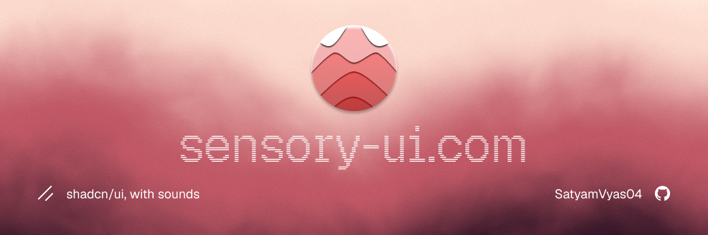

<div align="center">
  

**A semantic sound layer for React and Next.js.**

17 sound roles · 9 sound packs · 24 components - built for [shadcn/ui](https://ui.shadcn.com).

[Installation](#installation) · [Usage](#usage) · [Sound Packs](#sound-packs) · [Configuration](#configuration)

</div>

---

## Installation

```bash
npx shadcn@latest add SatyamVyas04/sensory-ui/sensory-ui
```

Or install individual pieces:

```bash
# Core engine only (no components)
npx shadcn@latest add SatyamVyas04/sensory-ui/sensory-ui-core

# Single component
npx shadcn@latest add SatyamVyas04/sensory-ui/sensory-ui-button
```

**Requirements:** Next.js 13.4+, shadcn/ui initialised, Node.js 18+.

---

## Usage

### 1. Wrap your app

```tsx
// app/layout.tsx
import { SensoryUIProvider } from "@/components/ui/sensory-ui/config/provider";

export default function RootLayout({
	children,
}: {
	children: React.ReactNode;
}) {
	return (
		<html lang="en">
			<body>
				<SensoryUIProvider>{children}</SensoryUIProvider>
			</body>
		</html>
	);
}
```

### 2. Add the `sound` prop

```tsx
import { Button } from "@/components/ui/sensory-ui/button";
import { Dialog, DialogTrigger, DialogContent } from "@/components/ui/sensory-ui/dialog";

// Single role
<Button sound="interaction.tap">Save</Button>

// Open/close sounds
<Dialog sound="overlay.open" closeSound="overlay.close">
  ...
</Dialog>
```

### 3. Use the hook

```tsx
import { usePlaySound } from "@/components/ui/sensory-ui/config/use-play-sound";

function MyComponent() {
	const { play } = usePlaySound({ sound: "interaction.subtle" });
	return <div onMouseEnter={play}>Hover me</div>;
}
```

---

## Configuration

```js
// sensory.config.js
module.exports = {
	enabled: true, // global kill-switch
	volume: 0.35, // master volume (0.0 – 1.0)
	theme: "aero", // active sound pack

	categories: {
		interaction: true,
		navigation: true,
		notification: true,
		overlay: true,
		hero: false, // disabled by default - opt in
	},

	overrides: {
		// Map any role to a custom audio file
		// "interaction.tap": "/sounds/my-click.mp3",
	},

	reducedMotion: "inherit",
};
```

---

## Sound Packs

All sounds are synthesized at runtime via the Web Audio API. No audio files, no network requests.

| Pack         | Character                  |
| ------------ | -------------------------- |
| `soft`       | Warm, rounded, gentle      |
| `aero`       | Airy, ethereal _(default)_ |
| `arcade`     | 8-bit chiptune             |
| `organic`    | Natural, wooden            |
| `glass`      | Crystalline, bright        |
| `industrial` | Metallic, mechanical       |
| `minimal`    | Clean, sparse              |
| `retro`      | Analog synth               |
| `crisp`      | Sharp, precise             |

Packs with effects chains (reverb, delay, chorus, distortion) for spatial/timbral depth:

| Pack         | Effects             |
| ------------ | ------------------- |
| `aero`       | Reverb (long tail)  |
| `glass`      | Reverb + Chorus     |
| `retro`      | Chorus + Delay      |
| `industrial` | Distortion          |
| `organic`    | Reverb (short room) |
| `soft`       | Reverb (warm)       |

---

## Sound Roles

17 semantic roles across 5 categories. Every sound maps to a meaningful interaction.

**`interaction`** - `tap` · `subtle` · `toggle` · `confirm`

**`overlay`** - `open` · `close` · `expand` · `collapse`

**`navigation`** - `forward` · `backward` · `tab`

**`notification`** - `info` · `success` · `warning` · `error`

**`hero`** - `complete` · `milestone` _(disabled by default)_

---

## Components

24 sound-enabled components — each a drop-in shadcn/ui replacement with a `sound` prop.

`accordion` · `alert-dialog` · `button` · `carousel` · `checkbox` · `collapsible` · `command` · `context-menu` · `dialog` · `drawer` · `dropdown-menu` · `menubar` · `navigation-menu` · `pagination` · `popover` · `radio-group` · `select` · `sheet` · `sidebar` · `slider` · `switch` · `tabs` · `toggle` · `toggle-group`

Plus `core` (engine, provider, config, sounds) — installed automatically as a dependency of every component.

---

## Development

```bash
git clone https://github.com/SatyamVyas04/sensory-ui.git
cd sensory-ui && npm install
npm run dev
```

The dev server runs the landing page at `localhost:3000` with an interactive component showcase.

---

## License

[MIT](./LICENSE) - free for personal and commercial use.

<div align="center">
  <sub>Built by <a href="https://X.com/SatyamVyas04">@SatyamVyas04</a></sub>
</div>
